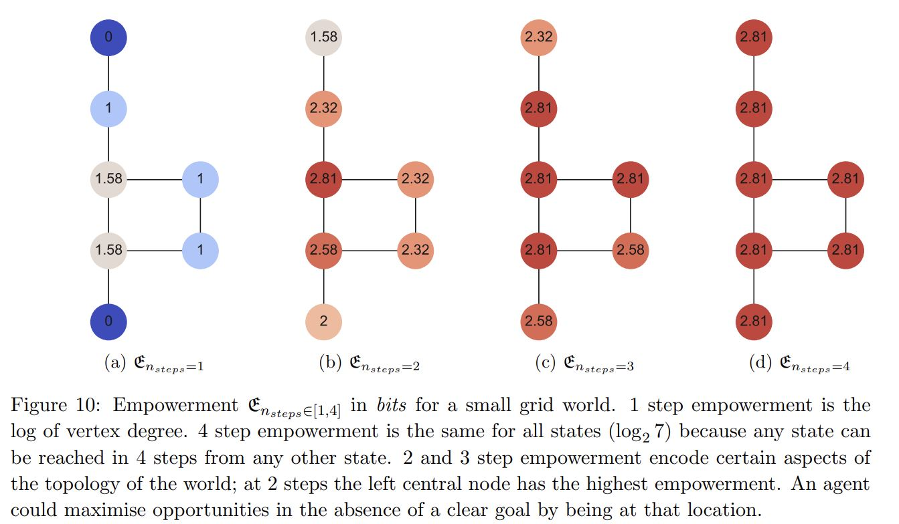
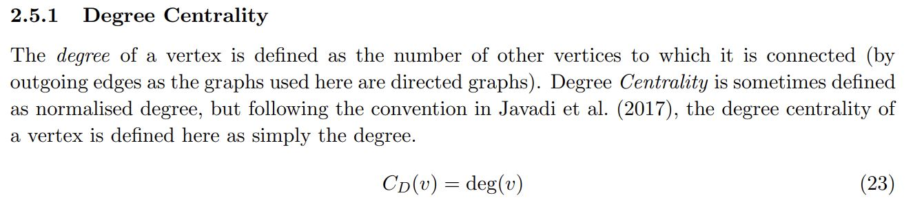
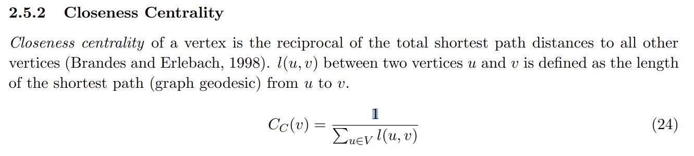
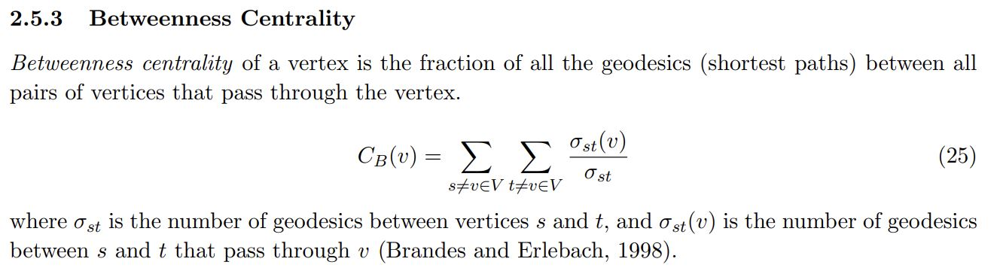

# Agent-Based Navigation in Graphs

This project implements **agent-based navigation using graph-theoretic and information-theoretic measures**. Inspired by Marcus Clements' [research](https://uhra.herts.ac.uk/bitstream/handle/2299/22616/15007732%20CLEMENTS%20Marcus%20Final%20Version%20of%20MSc%20by%20Research%20Submission.pdf?sequence=1&isAllowed=y) on navigation in urban environments. The agent simulates decision-making in graph networks through two methods:

- **Random Walks**
- **Shortest Pathfinding**

The agent tracks visited nodes and performs simulations to compare movement strategies. The project also implements core graph metrics:

- **Degree Centrality**
- **Closeness Centrality**
- **Betweenness Centrality**

## Features

- **Agent Simulation**: Navigate graphs using random walks and shortest paths.
- **Graph Metrics**: Calculate centrality measures to evaluate node importance.
- **Memory Tracking**: Record visited nodes to compare strategies.
- **Simulation Results**: Compare random walk and shortest path strategies over 1000 simulations.

## Research Paper

This work is based on:

**[Empowerment and Relevant Goal Information as Alternatives to Graph-Theoretic Centrality for Navigational Decision Making](https://uhra.herts.ac.uk/bitstream/handle/2299/22616/15007732%20CLEMENTS%20Marcus%20Final%20Version%20of%20MSc%20by%20Research%20Submission.pdf?sequence=1&isAllowed=y)** by Marcus Clements.

The paper explores the correlation between graph centrality and human navigation using empowerment and goal information measures.

## Implemented Graph

  
   <b>Figure 1: The Implemented Graph</b>

## Centrality Measures

  
  
  
   <b>Figure 2: Centrality Measures</b>

#### Have a great day :) 
